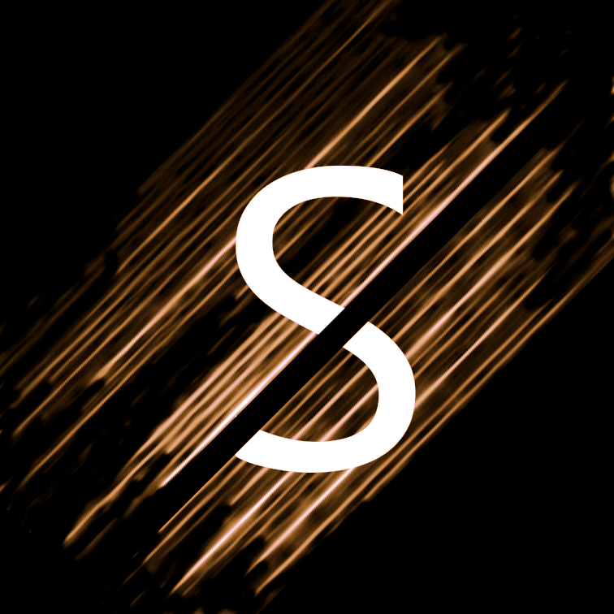

# Spectralysis
Sound manipulation via spectrogram. 
The program calculates a spectrogram for the chosen sound. On the bottom part, the user is able to draw. The drawing is then interpreted as Finite Impule Response (FIR) filter, which is applied to the sound signal. The result will appear in the top window.

## Installation
```shell
mkdir build
cd build
cmake ..
cmake --build . --config=Release
cmake --install .
cd outputs
python uiapp.py
```